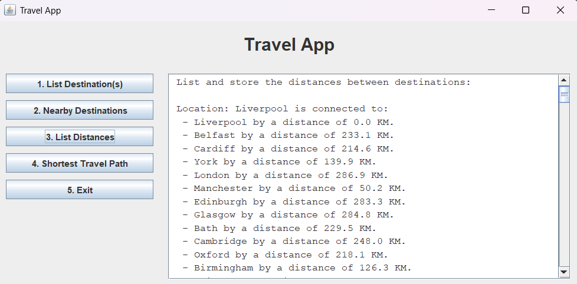
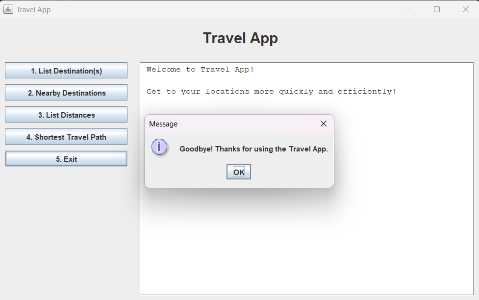

# ✈️ Prototype Travel App

A Java-based travel planning prototype that helps users explore destinations, calculate distances, and discover optimised travel routes between cities. Built using **object-oriented programming**, **custom data structures**, and **graph algorithms**, the app demonstrates practical use of **weighted graphs** and **Dijkstra’s algorithm** for solving real-world optimisation problems.

---

## 🚀 Features

* 📍 **List Destinations** – View all cities or search specific destinations by name.
* 🧭 **Nearby Locations** – Discover cities within a user-defined radius from selected coordinates.
* 📏 **Distance Calculator** – Compute and store distances between cities using a weighted graph model.
* 🔀 **Shortest Travel Path** – Generate the shortest route through selected destinations via **Dijkstra’s Algorithm**.
* 🖥️ **User-Friendly GUI** – Interactive Swing-based interface for smooth user experience and clear result display.

---

## 🛠️ Technologies Used

* **Java** – Core application logic built with Object-Oriented Programming principles.
* **Swing** – Used to develop the interactive GUI.
* **Custom Data Structures** – Graph and node structures designed from scratch to model city networks.
* **Algorithms** – Implemented **Dijkstra’s algorithm** for path optimisation.

---

## 🗂️ Project Structure

The `Travel_App` package includes the following core components:

* **Controller Interface** – Defines core operations available in the system.
* **GUI Class** – Handles user interaction and display via a menu-driven interface.
* **Graph & Node Classes** – Represent the weighted graph structure and individual cities.
* **Logic classes** – Implement routing logic, distance calculations, and helper utilities.

---

## ⚙️ How It Works

The app models destination cities as **nodes** in a **weighted graph**, where **edges** represent the distances between them. Users can calculate the shortest paths, explore nearby cities, and view travel details interactively. The system uses **Dijkstra’s algorithm** to perform fast and efficient pathfinding.

---

## 🖼️ Screenshots

### 🏠 Main GUI


### 🌍 List All Destinations


### 📍 Nearby Destinations


### 🔀 Shortest Paths



### ❌ Exiting the App



---

## 💼  Getting Started

1. **Clone the repository:**

   ```bash
   git clone https://github.com/usman-Iqbal-5/Travel_App.git
   ```

2. **Open the project** in your preferred Java IDE (e.g., IntelliJ IDEA, Eclipse).

3. **Compile and run** the `Main` class to launch the graphical interface.

4. **Interact with the app** using the menu options to access its features.

---

## 🔮 Future Enhancements

* 🌐 Integration with real-world map APIs for geolocation and route visualisation.
* 👤 User login and profile-based travel history.
* 🧠 Incorporate additional algorithms (e.g., **TSP heuristics** for complex routing).
* 🎨 Improved UI with modern design elements and responsiveness.

---

## ℹ️ Disclaimer

This application was developed as a **learning prototype** and is intended for **demonstration purposes only**. Not meant for production use or distribution.

