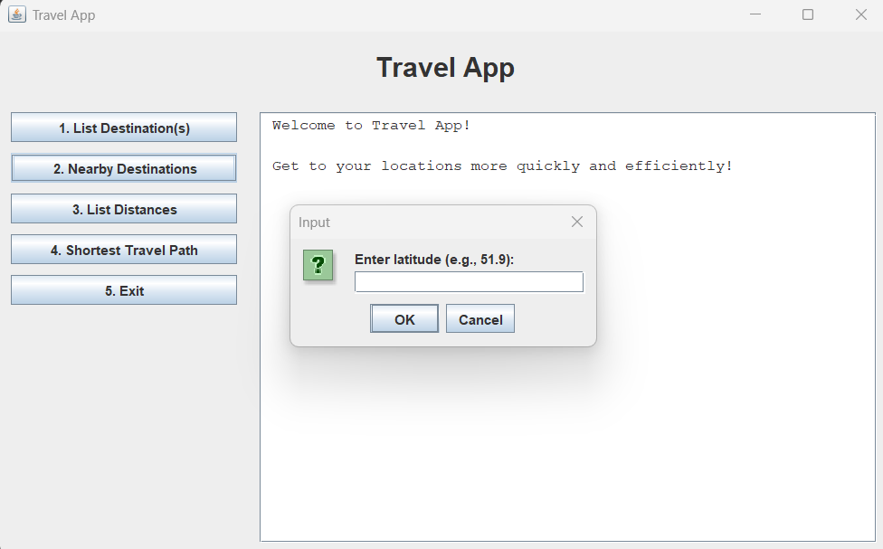

# Prototype Travel App

The prototype Travel App is a Java-based travel planning application designed to help users explore destinations, calculate distances, and find optimised travel routes between cities. Built using object-oriented programming principles, custom data structures, and advanced algorithms, this app showcases practical applications of weighted graphs and Dijkstra's algorithm to solve real-world optimisation problems.

## Features

* **List Destinations:** View information about all destination cities or search for specific cities.
* **Nearby Destinations:** Find cities within a specified distance radius from given coordinates.
* **Distance Calculation:** Compute and store distances between any two destinations using a weighted graph.
* **Shortest Travel Path:** Calculate the shortest travel route covering a list of user-selected cities using Dijkstra's algorithm.
* **Interactive GUI:** User-friendly Swing-based interface for intuitive interaction and clear output visualization.

## Technologies Used

* **Java** - Core programming language leveraging OOP concepts.
* **Swing** - For building the graphical user interface.
* **Custom Data Structures** - Implemented weighted graphs to model city connections and distances.
* **Algorithms** - Developed and applied Dijkstra's algorithm for shortest path computations.

## Project Structure

* `Travel_App` package contains core classes including:

  * **Controller Interface:** Defines operations available in the travel system.
  * **GUI:** GUI wrapper class providing menu-driven user interaction.
  * **Graph & Node Classes:** Represent the weighted graph data structure.
  * **Logic Classes:** Implements logic, algorithms and other helper methods.

## How It Works

The application models destination cities as nodes in a weighted graph, where edges represent distances between cities. Using this graph, the app can efficiently compute shortest paths and optimise travel routes based on user inputs. The GUI enables users to easily input queries and view results, making it practical for testing and demonstration purposes.

## Screenshots

### Main GUI with menu buttons and output area


### Listing all destinations


### Nearby destinations query



### Shortest path calculation result


## Getting Started

1. **Clone the repository**

   ```bash
   git clone https://github.com/yourusername/Travel_App.git
   ```
2. **Open the project in your Java IDE (e.g., Eclipse, IntelliJ).**
3. **Compile and run the `Main` class to launch the GUI.**
4. **Interact with the app through the GUI buttons to explore its features.**

## Future Improvements

* Integrate real-world map APIs for geolocation and mapping.
* Add user account support and travel history saving.
* Implement additional optimisation algorithms (e.g., traveling salesman heuristics).
* Enhance UI with richer visuals and responsive design.

